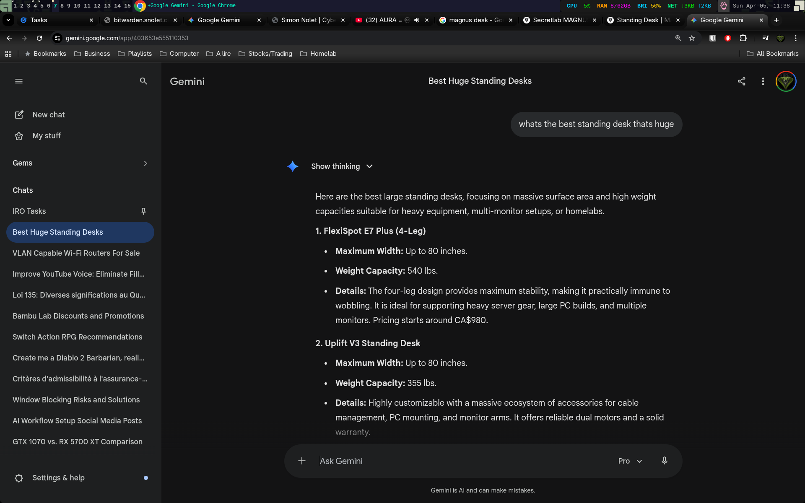

# Personal Dotfiles

My collection of configuration files for various tools and applications.

## Preview



## Contents

- **Awesome WM**: Dark theme with Steam Deck-style performance widgets
- **Alacritty**: Terminal emulator with multiple color themes

## Features

### Awesome WM - Steam Deck Style

The Awesome WM configuration features a modern, gaming-inspired aesthetic:

- **Performance Widgets** - Real-time system monitoring in the status bar:
  - CPU usage with color-coded thresholds (green → yellow → orange → red)
  - RAM usage in GB with visual indicators
  - Brightness percentage with battery-aware colors
  - Network speeds (upload/download) with automatic unit conversion

- **Visual Design**
  - Seamless borderless windows
  - Dark theme with cyan (`#00ffcc`) and magenta (`#ff9900`) accents
  - Rounded corners on the wibar
  - Semi-transparent status bar
  - No titlebars for a clean, immersive look

- **15 Workspace Tags** - Plenty of room for organizing your workflow

- **Smart Layout** - Floating, tile, fair, spiral, max, and more

## Installation

```bash
git clone https://github.com/ViperBlackSkull/dotfiles.git
cd dotfiles
./install.sh
```

## Requirements

- Awesome window manager
- Alacritty terminal
- [vicious](https://github.com/vicious-widgets/vicious) library for Awesome widgets
- Liberation Mono font (or modify to your preferred font)
- picom (optional, for compositor effects)

## Configuration Details

### Awesome WM
- Theme: Zenburn with custom dark mode optimizations
- Widgets: CPU, RAM, Brightness, Network (via vicious)
- Custom wallpaper support
- Keybindings: Standard Awesome + custom shortcuts

### Alacritty
- Main configuration file: `alacritty.toml`
- Color themes included:
  - gruvbox.yml
  - nord.yml
  - tokyo-night.yml
  - alacritty.yml (default)
